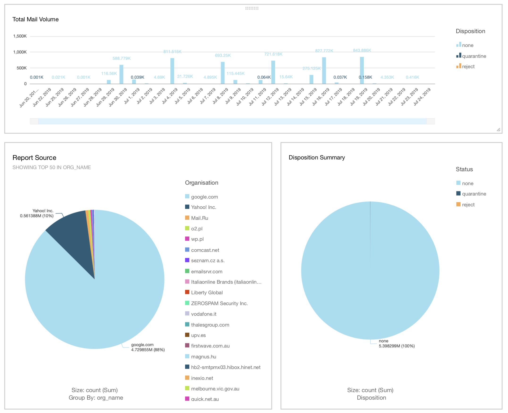

[](https://hub.docker.com/r/jamesjj/dmarc-report-ses-tsv/)
[](https://hub.docker.com/r/jamesjj/dmarc-report-ses-tsv/)

# DMARC Report: SES to TSV

*This component aims to provide DMARC Report data in TSV or CSV format, so that it can easily be ingested and visualised by business intelligence or analysis tools, for example AWS .*

  1. [AWS Simple Email Service (SES)](https://docs.aws.amazon.com/ses/latest/DeveloperGuide/receiving-email.html) can easily be set-up to recieve and save email to S3 storage.
  2. Emails saved in to S3 trigger events to be published to an AWS SQS Queue.
  3. *This service consumes messages from SQS, processes the email data from S3 to extract and decompress the DMARC report information. The resulting TSV data is compressed and stored in S3.*
  4. [AWS Athena](https://aws.amazon.com/athena/) can be used to directly run interactive SQL queries against the TSV data in S3.
  5. [AWS Quicksight](https://aws.amazon.com/quicksight/) can be used to directly visualise TSV data stored in S3.

This tool can be run ad-hoc, periodically as a traditional cron-job, or as a [Kubernetes CronJob](https://kubernetes.io/docs/concepts/workloads/controllers/cron-jobs/)

We do _not_ aim to process incoming reports and output to S3 as quickly as possible. Small CPU and memory requiremnts are prioritized, and we aim to process a reasonably large number of reports before outputting the TSV to S3. This avoids excessive numbers of tiny TSV files stored to S3.

## Configuration:

Configuration is specified using command line flags or environment variables. The environment variable name is the flag name, capitalized, and prefixed with `DMARC_`. For example to set the S3 bucket, you can use either CLI flag `-bucket=my-s3-bucket-name` or set environment variable `DMARC_BUCKET=my-s3-bucket-name`.


```
  -bucket string
        Name of the S3 bucket to store TSV files [MANDATORY] [DMARC_BUCKET]
        
  -bucketregion string
        AWS region of S3 bucket [MANDATORY] [DMARC_BUCKETREGION]
        
  -deletesqs
        Delete messages from SQS after processing [DMARC_DELETESQS] (default true)
        
  -emptypolls int
        How many consecutive times to poll SQS and receive zero messages before exiting, 1+ [DMARC_EMPTYPOLLS] (default 3)
        
  -maxrecords int
        Maximum number * 1024 of records in a single S3 file, 1+, e.g 2 sets the limit to 2048 [DMARC_MAXRECORDS] (default 32)
        
  -move string
        Move email to this S3 prefix after processing. Date will be automatically added [DMARC_MOVE]
        
  -pollmessages int
        SQS maximum messages per poll, 1-10 [DMARC_POLLMESSAGES] (default 10)
        
  -polltimeout int
        SQS slow poll timeout, 1-20 [DMARC_POLLTIMEOUT] (default 10)
        
  -sqs string
        Name of the SQS queue to poll [MANDATORY] [DMARC_SQS] 
        
  -sqsprocessingtime int
        SQS visibility timeout [DO NOT CHANGE] [DMARC_SQSPROCESSINGTIME] (default 3600)
        
  -sqsregion string
        AWS region of SQS queue [MANDATORY] [DMARC_SQSREGION]
        
  -verbose
        Show detailed information during run [DMARC_VERBOSE]
```

*AWS credentials are expected to be read from instance IAM profile, or read from environment variables (`AWS_ACCESS_KEY_ID`, `AWS_SECRET_ACCESS_KEY`)*

## Athena & Quicksight

Athena can be used to run SQL queries directly against to TSV data in S3. The file [./doc/column-definition-for-aws-athena.txt](https://raw.githubusercontent.com/JamesJJ/dmarc-report-ses-tsv/master/doc/column-definition-for-aws-athena.txt) includes the TSV column definitions in the correct format for bulk configuration of Athena.

#### Example Athena query
```
SELECT disposition,
         sum(count) AS number
FROM "vr_prod_dmarc"."dmarc_data_v1"
WHERE disposition != ''
GROUP BY  disposition
ORDER BY  number desc
```

**Result:**


|   | disposition      | number   |
|---|------------------|----------|
| 1 | none             | 5398299  |
| 2 | quarantine       | 1634     |
| 3 | reject           | 2        |


#### Simple Quicksight Report Example

